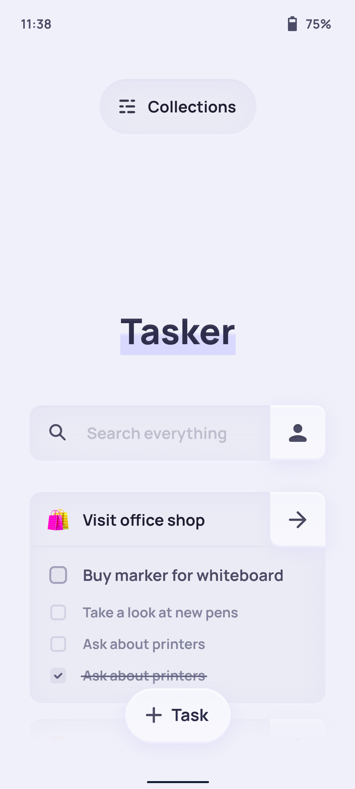

# **Slikker Kit**
### Slikker Kit is a Flutter package which provides Slikker Design System components


##### The preview of the future version `1.1.0`.

<br>

## **Installation**

1. In your `pubspec.yaml` file add the following dependency:
```yaml
dependencies:
   ...
   slikker_kit: ^1.0.10
```
2. Run the command to update dependencies:
```
$ flutter pub get
```

<br>

## Usage

1. Import `slikker_kit` to your dart file:
```dart
import 'package:slikker_kit/slikker_kit.dart';
```
2. Now you can use Slikker components! Example:

```dart
Widget button = SlikkerCard(
   padding: EdgeInsets.all(15),
   accent: 240,
   borderRadius: BorderRadius.circular(12),
   child: Text('Hello World!'),
   onTap: () => print('Yayyy'),
);
```
#### // Component list coming soon

<br>

## License
MIT License

Copyright (c) 2020 Alexey Besida

[Full licence](LICENSE.md)